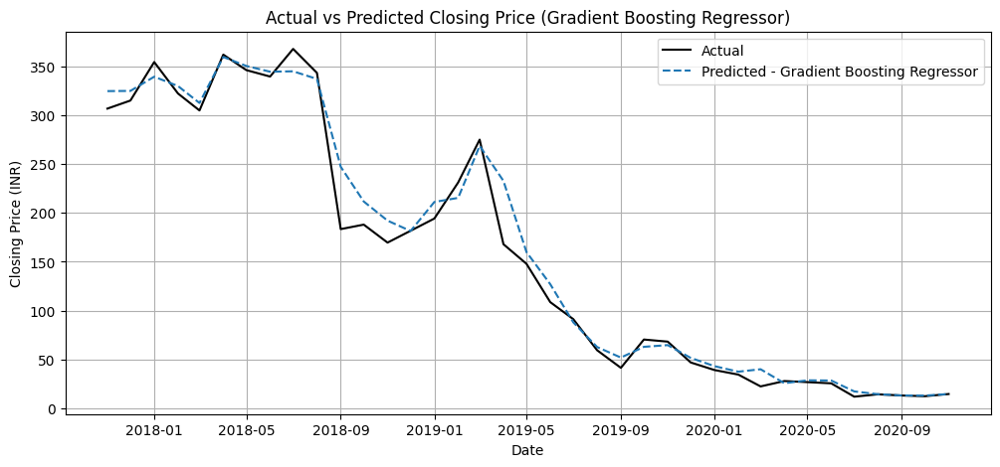

# 📈Yes Bank Stock Price Prediction

## 🚀 Project Overview

This project focuses on forecasting the monthly closing prices of **Yes Bank Shares** using advanced ensemble machine learning models. Accurate price prediction is crucial for financial decision-making and this solution is tailored for that purpose using a structured ML pipeline with rigorous analysis and modeling techniques.

---

## 📌 Problem Statement

The share prices of **Yes Bank** have shown significant volatility over the years. This project aims to build a regression model to **predict the monthly closing stock prices** based on historical trends and engineered features.

---

## 📊 Project Workflow

### 1. 🧹 Data Cleaning and Preprocessing
- Handled null values and ensured correct datetime formatting.
- Removed irrelevant columns to focus on informative features.

### 2. 📈 Exploratory Data Analysis (EDA)
Following the **UBM Rule** -
- **Univariate Analysis** - Distribution of individual variables.
- **Bivariate Analysis** - Relationships between features and the target.
- **Multivariate Analysis** - Correlation heatmaps and multi-feature plots.

### 3. 🧪 Hypothesis Testing
- Applied statistical tests to verify assumptions regarding feature influence.
- Conducted correlation and trend tests to guide feature selection.

### 4. 🛠️ Feature Engineering
- Created new features such as moving averages, volatility indicators and time-based variables.
- Standardized numeric features using `StandardScaler`.

### 5. 🤖 Model Building
Used three powerful ensemble models:
- **Random Forest Regressor**
- **Gradient Boosting Regressor**
- **XGBoost Regressor**

### 6. ✅ Evaluation Metrics
Models were evaluated using -
- **Root Mean Squared Error (RMSE)**
- **Mean Absolute Error (MAE)**
- **R² Score**

---

## 🛠️ Technologies Used

- **Python**
- **Pandas, NumPy** – Data manipulation
- **Matplotlib, Seaborn** – Data visualization
- **Scikit-learn** – ML preprocessing and modeling
- **XGBoost** – Advanced gradient boosting
- **Google Colab** – Notebook environment
---

## 📈 Results

All three models showed promising performance, with **Gradient Boosting Regressor** slightly outperforming the others in terms of RMSE and R². The final model is capable of providing reliable closing price forecasts for Yes Bank.

